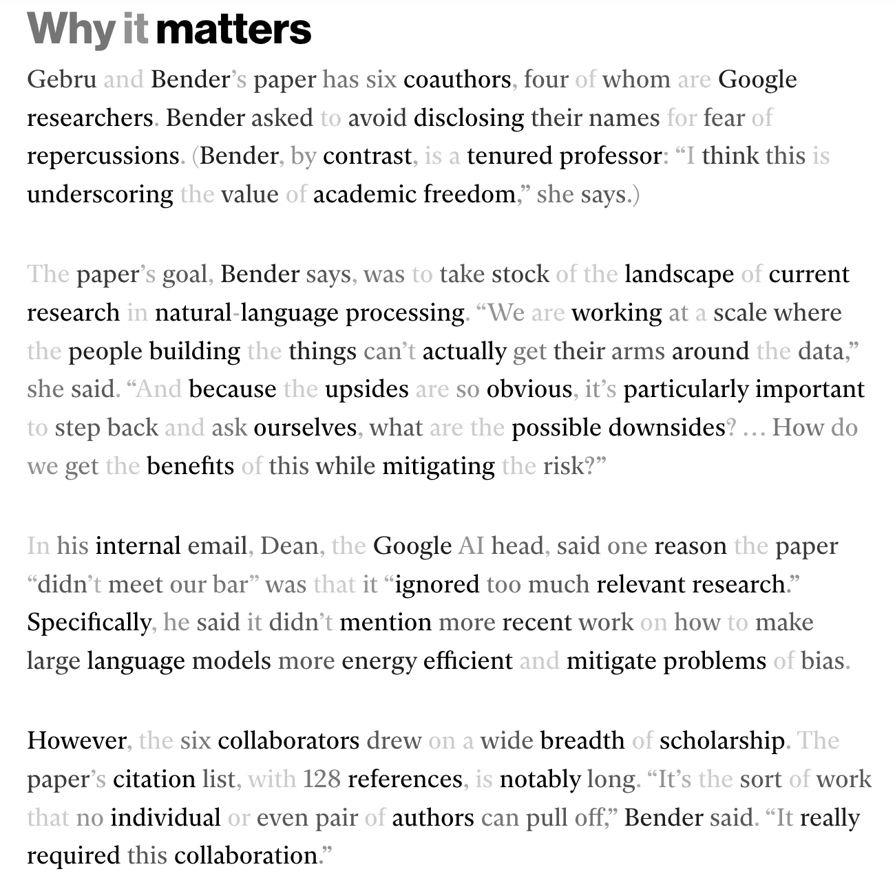

# Skim Tool

The Skim Tool in effect looks like this:

It is Firefox extension that modulates text opacity to highlight only semantically important words in web pages. It uses a local BERT-style (RoBERTa) model, so no "AI-summarization" crap. The content is there, it just becomes easier to skim.

## Installation (Firefox)
1. Open Firefox and navigate to about:debugging#/runtime/this-firefox.
2. Click "Load Temporary Add-on".
3. Select manifest.json in the Skim Tool folder.
4. The Skim Tool icon appears in the toolbar.

## Run the Scoring Server
- `pip install flask flask-cors torch transformers`
- `python source/server.py`
- Keep it running while using the extension.

## Usage
1. Open a text-heavy web page.
2. Click the Skim Tool toolbar icon.
3. In the popup:
   - Set Mode to "server" for BERT-based highlights. Heuristic mode does NOT require a server, it uses simple/silly text heuristics, so it is not very good.
   - Click "Apply" to highlight text.
4. Click "Clear" to remove highlights.

## Credits
Disclaimer: this app is vibe-coded. It is based on the following paper:

Gu, Ziwei, Ian Arawjo, Kenneth Li, Jonathan K. Kummerfeld, and Elena L. Glassman. "An AI-resilient text rendering technique for reading and skimming documents." In Proceedings of the 2024 CHI Conference on Human Factors in Computing Systems, pp. 1-22. 2024.

Here is their [code](https://github.com/ZiweiGu/GP-TSM?tab=readme-ov-file). They used GPT so their results are much better in terms of readability, but their live demo was not available when I tried it.
